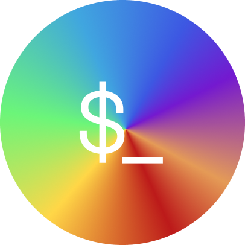

<div align="center">
  
  <h1>Spektr</h1>

[![][site-badge]][site-url] [![npm][npm-img]][npm-url]
[![GitHub Workflow
Status][gh-actions-img]][github-actions]
[![Coverage][cov-img]][cov-url]

</div>

Elegant CLI framework. Inspired by [cac](https://github.com/cacjs/cac). Works
with Deno, Node.js and Bun.

## Features

- Infinite nesting for commands (aka `git remote add`)
- Default command support
- Automatic help/version, including individual commands and programs
- Argument validation
- Auto-complete for options
- Pluggable (color plugin out-of-the-box)
- Middleware API to run before commands

## Install

```sh
# Bun
bun i spektr
# pnpm
pnpm i spektr
# Deno
echo "export { CLI } from 'https://deno.land/x/spektr/spektr.ts'" >> deps.ts
```

## Example

```ts
import { CLI } from 'https://deno.land/x/spektr/spektr.ts'
import { colorPlugin } from 'https://deno.land/x/spektr/spektr/plugins/color.ts'

const cli = new CLI({ name: 'spektr', plugins: [colorPlugin] })

cli.command(
  'hello',
  (_, args) => {
    args.name ? console.log(`Hello ${args.name}!`) : console.log('Hello!')
  },
  {
    options: [
      { name: 'name', description: 'your name', type: 'string', short: ['n'] },
    ] as const,
  },
)

cli.version()

cli.help()

cli.handle(Deno.args)
```

[site-url]: https://deno.land/x/spektr?doc
[npm-url]: https://npmjs.com/package/spektr
[github-actions]: https://github.com/StauroDEV/spektr/actions
[gh-actions-img]: https://img.shields.io/github/actions/workflow/status/StauroDEV/spektr/deno.yml?branch=master&style=for-the-badge&logo=github&label=&color=1B2A22
[cov-img]: https://img.shields.io/coveralls/github/StauroDEV/spektr?style=for-the-badge&color=1B2A22
[cov-url]: https://coveralls.io/github/StauroDEV/spektr
[npm-img]: https://img.shields.io/npm/dt/spektr?style=for-the-badge&color=1B2A22&logo=npm&label=
[site-badge]: https://img.shields.io/badge/docs-open-1B2A22?style=for-the-badge
